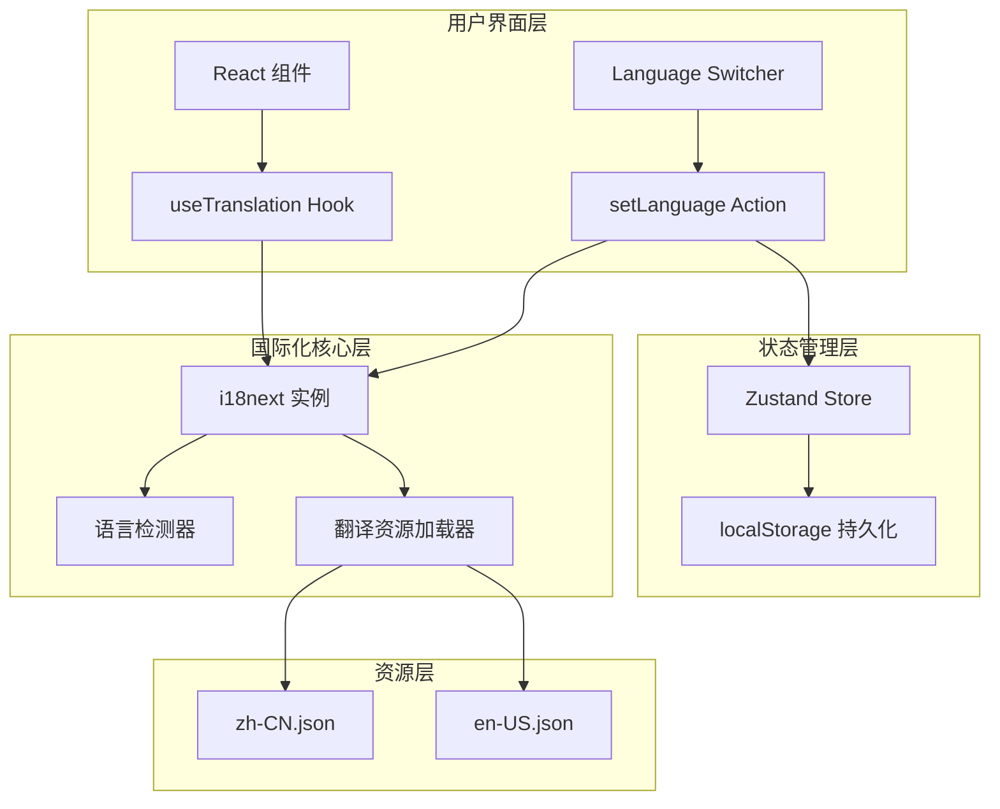
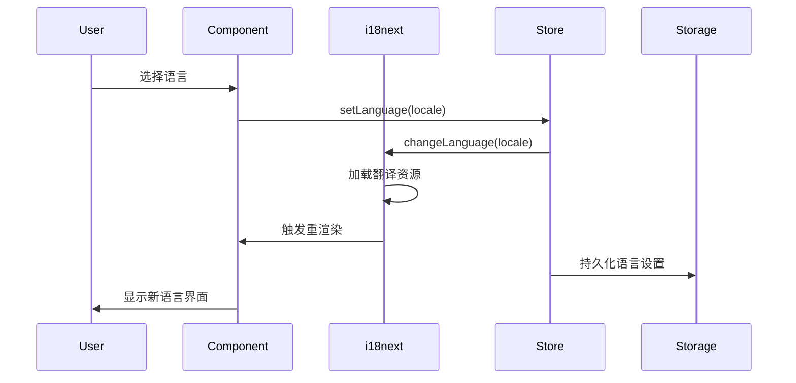

# 设计文档

## 概述

本设计文档描述 NavHub 国际化（i18n）功能的技术实现方案。采用 react-i18next 作为核心库，结合 Zustand 状态管理，实现一个可扩展、高性能的多语言支持系统。

## 架构

### 整体架构图



### 数据流



## 组件和接口

### 1. i18n 配置模块

**文件位置**: `src/config/i18n.ts`

```typescript
interface I18nConfig {
  defaultLanguage: string;
  supportedLanguages: string[];
  fallbackLanguage: string;
  debug: boolean;
  interpolation: {
    escapeValue: boolean;
  };
}

// 初始化函数
function initI18n(): i18n;

// 语言检测函数
function detectUserLanguage(): string;
```

### 2. 语言状态管理

**扩展 useAppStore**: `src/stores/useAppStore.ts`

```typescript
interface LanguageSlice {
  currentLanguage: string;
  setLanguage: (locale: string) => void;
  initLanguage: () => void;
}
```

### 3. 翻译 Hook 封装

**文件位置**: `src/hooks/useI18n.ts`

```typescript
interface UseI18nReturn {
  t: TFunction;
  i18n: i18n;
  currentLanguage: string;
  changeLanguage: (locale: string) => Promise<void>;
  supportedLanguages: LanguageOption[];
}

interface LanguageOption {
  code: string;
  name: string;
  nativeName: string;
  flag: string;
}
```

### 4. 语言切换组件

**文件位置**: `src/components/ui/LanguageSwitcher.tsx`

```typescript
interface LanguageSwitcherProps {
  variant?: 'dropdown' | 'buttons';
  showFlag?: boolean;
  showNativeName?: boolean;
}
```

## 数据模型

### 翻译文件结构

```typescript
interface TranslationResource {
  common: CommonTranslations;
  header: HeaderTranslations;
  sidebar: SidebarTranslations;
  settings: SettingsTranslations;
  modals: ModalsTranslations;
  errors: ErrorTranslations;
}

interface CommonTranslations {
  save: string;
  cancel: string;
  delete: string;
  edit: string;
  add: string;
  close: string;
  confirm: string;
  loading: string;
  search: string;
  // ...
}

interface SettingsTranslations {
  title: string;
  tabs: {
    site: string;
    ai: string;
    appearance: string;
    data: string;
  };
  site: {
    pageTitle: string;
    favicon: string;
    // ...
  };
  // ...
}
```

### 支持的语言配置

```typescript
const SUPPORTED_LANGUAGES = [
  {
    code: 'zh-CN',
    name: 'Chinese (Simplified)',
    nativeName: '简体中文',
    flag: '🇨🇳'
  },
  {
    code: 'en-US',
    name: 'English (US)',
    nativeName: 'English',
    flag: '🇺🇸'
  }
] as const;
```

## 正确性属性

*正确性属性是指在系统所有有效执行中都应保持为真的特征或行为——本质上是关于系统应该做什么的形式化陈述。属性作为人类可读规范和机器可验证正确性保证之间的桥梁。*

### Property 1: 翻译键回退

*For any* 不存在于当前语言翻译文件中的翻译键，系统应回退到默认语言（中文）的翻译，如果默认语言也不存在，则返回键名本身。

**Validates: Requirements 1.5, 7.5**

### Property 2: 插值变量替换

*For any* 包含插值变量（如 `{{name}}`、`{{count}}`）的翻译文本和任意变量值，翻译函数应正确将变量占位符替换为实际值。

**Validates: Requirements 2.4**

### Property 3: 复数形式处理

*For any* 支持复数形式的翻译键和任意数量值，系统应根据数量返回正确的复数形式（如 0 个、1 个、多个）。

**Validates: Requirements 2.5**

### Property 4: 语言切换同步

*For any* 支持的语言，当调用 setLanguage 切换语言后，i18next 实例的当前语言应与 Zustand store 中的 currentLanguage 保持一致，且所有使用 useTranslation 的组件应显示新语言的翻译。

**Validates: Requirements 3.2, 5.4**

### Property 5: 语言设置持久化往返

*For any* 支持的语言设置，设置语言后持久化到 localStorage，然后重新初始化应用，应能正确恢复之前的语言设置。

**Validates: Requirements 3.3, 5.3**

### Property 6: 浏览器语言检测

*For any* 浏览器语言设置，当用户首次访问且 localStorage 中无语言设置时，系统应检测浏览器语言并设置为最匹配的支持语言，如果无匹配则使用默认语言。

**Validates: Requirements 3.4**

### Property 7: 翻译文件键一致性

*For any* 翻译键存在于任一语言文件中，该键应同时存在于所有支持的语言文件中，确保翻译完整性。

**Validates: Requirements 6.5**

### Property 8: 翻译键嵌套深度

*For any* 翻译文件中的翻译键，其嵌套深度不应超过 3 层，以保持结构的可维护性。

**Validates: Requirements 6.3**

### Property 9: 翻译资源缓存

*For any* 已加载的语言资源，再次请求相同语言时应使用缓存而非重新加载，验证方式为第二次加载时间显著小于首次加载。

**Validates: Requirements 8.2**

### Property 10: 语言切换性能

*For any* 语言切换操作，从调用 changeLanguage 到界面完成更新的时间应小于 100ms。

**Validates: Requirements 8.3**

## 错误处理

### 翻译加载失败

```typescript
// 当翻译资源加载失败时的处理
const handleLoadError = (lng: string, ns: string, error: Error) => {
  console.error(`Failed to load ${ns} for ${lng}:`, error);
  // 回退到默认语言
  if (lng !== DEFAULT_LANGUAGE) {
    i18n.loadNamespaces(ns);
  }
};
```

### 无效语言代码

```typescript
// 当用户尝试设置不支持的语言时
const setLanguage = (locale: string) => {
  if (!SUPPORTED_LANGUAGES.includes(locale)) {
    console.warn(`Unsupported language: ${locale}, falling back to default`);
    locale = DEFAULT_LANGUAGE;
  }
  // 继续设置语言...
};
```

### localStorage 不可用

```typescript
// 当 localStorage 不可用时（如隐私模式）
const persistLanguage = (locale: string) => {
  try {
    localStorage.setItem(LANGUAGE_KEY, locale);
  } catch (error) {
    console.warn('Failed to persist language preference:', error);
    // 仅在内存中保持设置
  }
};
```

## 测试策略

### 单元测试

1. **i18n 配置测试**
   - 验证 i18next 实例正确初始化
   - 验证支持的语言列表正确
   - 验证默认语言设置正确

2. **翻译函数测试**
   - 测试基本翻译键获取
   - 测试嵌套键访问
   - 测试插值变量替换
   - 测试复数形式处理

3. **语言切换测试**
   - 测试 setLanguage action
   - 测试 localStorage 持久化
   - 测试语言恢复

### 属性测试

使用 fast-check 进行属性测试，每个属性测试至少运行 100 次迭代。

1. **翻译键回退属性测试**
   - 生成随机的不存在翻译键
   - 验证回退行为正确

2. **插值变量替换属性测试**
   - 生成随机变量名和值
   - 验证替换结果正确

3. **语言设置往返属性测试**
   - 随机选择支持的语言
   - 验证持久化和恢复一致

4. **翻译文件键一致性属性测试**
   - 遍历所有语言文件的键
   - 验证键集合一致

### 集成测试

1. **组件渲染测试**
   - 测试组件在不同语言下的渲染
   - 测试语言切换后的重渲染

2. **设置面板集成测试**
   - 测试语言切换器的交互
   - 测试设置保存和恢复

