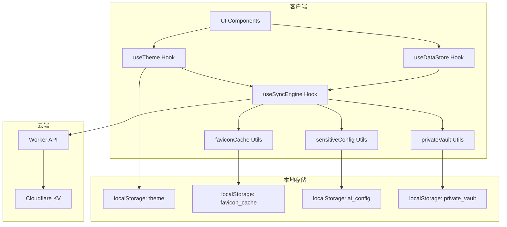
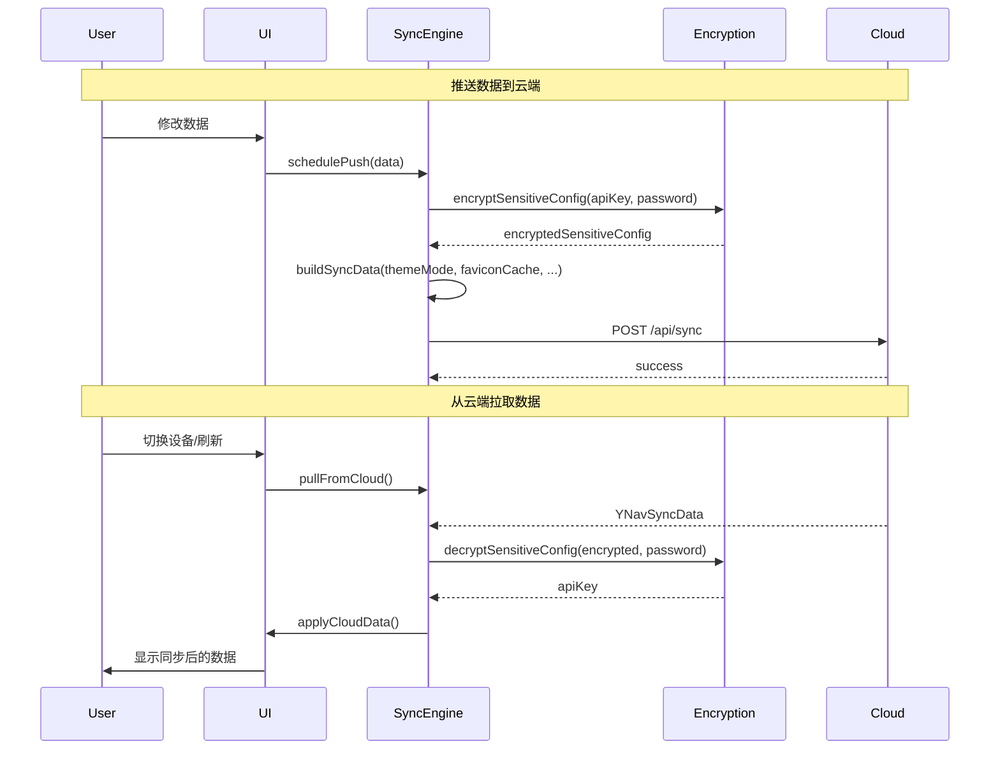

# Design Document: Sync Data Enhancement

## Overview

本设计文档描述了 NavHub 同步系统增强功能的技术实现方案。该增强功能解决三个核心问题：

1. **主题偏好同步** - 将 `themeMode` 纳入同步数据结构
2. **敏感配置加密同步** - 使用与 privateVault 相同的加密机制保护 API Key
3. **Favicon 缓存同步** - 同步用户自定义图标，优化跨设备体验

设计遵循以下原则：
- 向后兼容：新字段为可选，旧客户端可正常工作
- 统一加密：复用现有 PBKDF2 + AES-GCM 加密机制
- 最小同步负载：只同步必要数据，避免过大的同步包

## Architecture



### 数据流



## Components and Interfaces

### 1. 扩展的同步数据结构

```typescript
// src/types.ts - 扩展 YNavSyncData
export interface YNavSyncData {
  // 现有字段
  links: LinkItem[];
  categories: Category[];
  searchConfig?: SearchConfig;
  aiConfig?: AIConfig;  // apiKey 将被脱敏
  siteSettings?: SiteSettings;
  privateVault?: string;  // 已加密的私密链接
  meta: SyncMetadata;
  
  // 新增字段
  themeMode?: ThemeMode;  // 'light' | 'dark' | 'system'
  encryptedSensitiveConfig?: string;  // 加密的敏感配置（包含 apiKey）
  customFaviconCache?: CustomFaviconCache;  // 用户自定义图标缓存
}

// 敏感配置载荷
export interface SensitiveConfigPayload {
  apiKey?: string;
  // 未来可扩展其他敏感配置
}

// 自定义 Favicon 缓存
export interface CustomFaviconCache {
  entries: FaviconCacheEntry[];
  updatedAt: number;
}

export interface FaviconCacheEntry {
  hostname: string;
  iconUrl: string;
  isCustom: boolean;  // true = 用户手动设置, false = 自动获取
  updatedAt: number;
}
```

### 2. 敏感配置加密模块

```typescript
// src/utils/sensitiveConfig.ts
export interface SensitiveConfigPayload {
  apiKey?: string;
}

/**
 * 加密敏感配置
 * 使用与 privateVault 相同的加密机制
 */
export async function encryptSensitiveConfig(
  password: string, 
  payload: SensitiveConfigPayload
): Promise<string>;

/**
 * 解密敏感配置
 */
export async function decryptSensitiveConfig(
  password: string, 
  cipherText: string
): Promise<SensitiveConfigPayload>;
```

### 3. Favicon 缓存管理模块

```typescript
// src/utils/faviconCache.ts
export interface FaviconCacheManager {
  /**
   * 获取完整的本地缓存
   */
  getLocalCache(): Record<string, string>;
  
  /**
   * 获取用户自定义图标（用于同步）
   */
  getCustomIcons(): FaviconCacheEntry[];
  
  /**
   * 设置图标（标记是否为自定义）
   */
  setIcon(hostname: string, iconUrl: string, isCustom: boolean): void;
  
  /**
   * 合并云端缓存到本地
   */
  mergeFromCloud(cloudCache: CustomFaviconCache): void;
  
  /**
   * 构建用于同步的缓存数据
   */
  buildSyncCache(): CustomFaviconCache;
}
```

### 4. 扩展的同步引擎

```typescript
// src/hooks/useSyncEngine.ts - 扩展 buildSyncData
export function buildSyncData(
  links: LinkItem[],
  categories: Category[],
  searchConfig?: SearchConfig,
  aiConfig?: AIConfig,
  siteSettings?: SiteSettings,
  privateVault?: string,
  // 新增参数
  themeMode?: ThemeMode,
  encryptedSensitiveConfig?: string,
  customFaviconCache?: CustomFaviconCache
): Omit<YNavSyncData, 'meta'>;
```

### 5. 主题同步集成

```typescript
// src/hooks/useTheme.ts - 扩展
export function useTheme() {
  // 现有返回值
  themeMode: ThemeMode;
  darkMode: boolean;
  toggleTheme: () => void;
  setThemeAndApply: (mode: ThemeMode) => void;
  
  // 新增：从同步数据应用主题
  applyFromSync: (syncedThemeMode: ThemeMode) => void;
}
```

## Data Models

### 本地存储结构

| Key | 类型 | 描述 |
|-----|------|------|
| `theme` | `ThemeMode` | 主题模式 ('light' \| 'dark' \| 'system') |
| `ynav_favicon_cache` | `Record<string, string>` | 完整 favicon 缓存 |
| `ynav_favicon_custom` | `string[]` | 用户自定义图标的 hostname 列表 |
| `ynav_ai_config` | `AIConfig` | AI 配置（本地包含明文 apiKey） |
| `ynav_private_vault_v1` | `string` | 加密的私密链接 |

### 云端同步数据结构

```typescript
{
  // 现有字段
  links: LinkItem[],
  categories: Category[],
  searchConfig: SearchConfig,
  aiConfig: {
    provider: 'gemini' | 'openai',
    apiKey: '',  // 始终为空，真实值在 encryptedSensitiveConfig
    baseUrl: string,
    model: string,
    // ...
  },
  siteSettings: SiteSettings,
  privateVault: string,  // 加密字符串
  
  // 新增字段
  themeMode: 'light' | 'dark' | 'system',
  encryptedSensitiveConfig: string,  // 加密字符串
  customFaviconCache: {
    entries: [
      { hostname: 'github.com', iconUrl: 'data:image/...', isCustom: true, updatedAt: 1234567890 }
    ],
    updatedAt: 1234567890
  },
  
  meta: SyncMetadata
}
```

### 加密数据格式

敏感配置和私密保险库使用相同的加密格式：

```
v1.<salt_base64>.<iv_base64>.<encrypted_data_base64>
```

- 版本号: `v1`
- Salt: 16 字节，PBKDF2 密钥派生
- IV: 12 字节，AES-GCM 初始化向量
- 加密数据: AES-256-GCM 加密后的 JSON 字符串


## Correctness Properties

*A property is a characteristic or behavior that should hold true across all valid executions of a system—essentially, a formal statement about what the system should do. Properties serve as the bridge between human-readable specifications and machine-verifiable correctness guarantees.*

Based on the prework analysis, the following correctness properties have been identified. Redundant properties have been consolidated to ensure each provides unique validation value.

### Property 1: Theme Mode Sync Data Inclusion

*For any* valid ThemeMode value ('light' | 'dark' | 'system'), when buildSyncData is called with that themeMode, the resulting YNavSyncData SHALL contain a themeMode field equal to the input value.

**Validates: Requirements 1.1, 1.4**

### Property 2: Theme Mode Application from Sync

*For any* YNavSyncData containing a valid themeMode, when applyFromSync is called, the local themeMode state SHALL equal the synced themeMode value.

**Validates: Requirements 1.2**

### Property 3: System Theme Mode Respects Device Preference

*For any* device with a system color scheme preference (light or dark), when themeMode is 'system', the computed darkMode boolean SHALL equal true if and only if the system preference is dark.

**Validates: Requirements 1.3**

### Property 4: Sensitive Config Encryption Round-Trip

*For any* SensitiveConfigPayload containing an apiKey string and any non-empty password string, encrypting then decrypting with the same password SHALL produce an equivalent SensitiveConfigPayload.

**Validates: Requirements 2.1, 2.2, 2.3, 5.1**

### Property 5: Wrong Password Returns Empty ApiKey

*For any* encrypted SensitiveConfig and any password different from the encryption password, decryption SHALL either throw an error or return a payload with empty/undefined apiKey.

**Validates: Requirements 2.4**

### Property 6: Non-Admin Response Sanitization

*For any* YNavSyncData returned to non-admin users, the aiConfig.apiKey field SHALL be an empty string regardless of the original value.

**Validates: Requirements 2.5**

### Property 7: Only Custom Favicons Are Synced

*For any* local favicon cache containing both custom (user-set) and auto-fetched icons, buildSyncCache SHALL return a CustomFaviconCache containing only entries where isCustom is true.

**Validates: Requirements 3.1, 3.4**

### Property 8: Custom Icon Marking

*For any* icon set via user action (manual URL input or file upload), the corresponding FaviconCacheEntry SHALL have isCustom set to true.

**Validates: Requirements 3.2**

### Property 9: Favicon Cache Merge Prefers Custom

*For any* local cache and cloud cache with overlapping hostnames where the cloud entry is custom, mergeFromCloud SHALL result in the cloud's custom entry overwriting the local entry for that hostname.

**Validates: Requirements 3.3**

### Property 10: Favicon Merge Preserves Local Auto-Fetched

*For any* local cache containing auto-fetched icons and cloud cache not containing those hostnames, mergeFromCloud SHALL preserve all local auto-fetched entries.

**Validates: Requirements 3.5**

### Property 11: Sync Data Parsing Robustness

*For any* valid YNavSyncData (with or without optional fields themeMode, encryptedSensitiveConfig, customFaviconCache), parsing SHALL succeed and missing fields SHALL default to undefined without throwing errors.

**Validates: Requirements 4.2, 4.3, 4.4**

### Property 12: Password Change Re-encrypts Both Vaults

*For any* existing privateVault and encryptedSensitiveConfig encrypted with password A, when the password is changed to B, both SHALL be re-encrypted such that decryption with B succeeds and decryption with A fails.

**Validates: Requirements 5.2**

### Property 13: Unified Unlock Decrypts Both

*For any* privateVault and encryptedSensitiveConfig encrypted with the same password, when unlockPrivateVault succeeds, the decrypted SensitiveConfig SHALL also be available.

**Validates: Requirements 5.3**

### Property 14: Separate Passwords Work Independently

*For any* privateVault encrypted with password A and encryptedSensitiveConfig encrypted with password B (where A ≠ B), decrypting privateVault with A SHALL succeed while decrypting encryptedSensitiveConfig with A SHALL fail, and vice versa.

**Validates: Requirements 5.4**

## Error Handling

### 加密/解密错误

| 错误场景 | 处理方式 |
|---------|---------|
| 密码错误 | 捕获 AES-GCM 解密错误，返回空 payload，提示用户重新输入密码 |
| 加密数据格式无效 | 验证 `v1.<salt>.<iv>.<data>` 格式，格式错误时返回空 payload |
| 密码未设置 | 跳过加密/解密，敏感数据不参与同步 |

### 同步错误

| 错误场景 | 处理方式 |
|---------|---------|
| 网络错误 | 设置 syncStatus 为 'error'，保留本地数据，下次重试 |
| 版本冲突 | 设置 syncStatus 为 'conflict'，触发 onConflict 回调让用户选择 |
| 云端数据缺少新字段 | 使用默认值，不影响其他数据的应用 |

### Favicon 缓存错误

| 错误场景 | 处理方式 |
|---------|---------|
| 图标 URL 无效 | 标记为失效，下次访问时自动重新获取 |
| 缓存解析失败 | 重置为空缓存，不影响应用运行 |
| 合并冲突 | 优先使用 isCustom=true 的条目，时间戳较新的优先 |

## Testing Strategy

### 测试方法

本功能采用双重测试策略：

1. **单元测试** - 验证具体示例和边界情况
2. **属性测试** - 验证所有输入的通用属性

### 属性测试配置

- 使用 `fast-check` 库进行属性测试
- 每个属性测试最少运行 100 次迭代
- 每个测试用注释标记对应的设计文档属性

### 测试覆盖

| 模块 | 单元测试 | 属性测试 |
|------|---------|---------|
| sensitiveConfig.ts | 加密格式验证、空输入处理 | Property 4, 5, 12, 14 |
| faviconCache.ts | 缓存读写、合并逻辑 | Property 7, 8, 9, 10 |
| useTheme.ts | 主题切换、系统偏好 | Property 2, 3 |
| useSyncEngine.ts | 同步数据构建、解析 | Property 1, 6, 11 |
| 集成测试 | 完整同步流程 | Property 13 |

### 测试标签格式

```typescript
// Feature: sync-data-enhancement, Property 4: Sensitive Config Encryption Round-Trip
it.prop([fc.string(), fc.string().filter(s => s.length > 0)], { numRuns: 100 })(
  'encrypting then decrypting produces equivalent payload',
  async (apiKey, password) => {
    // ...
  }
);
```
